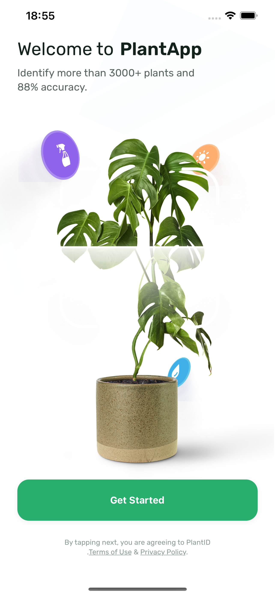
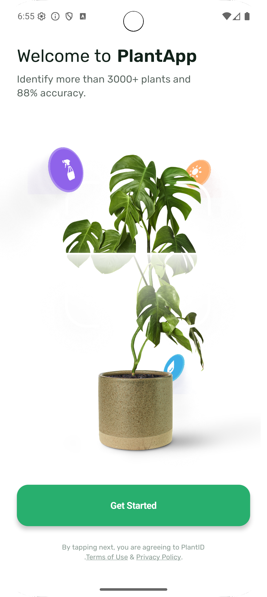
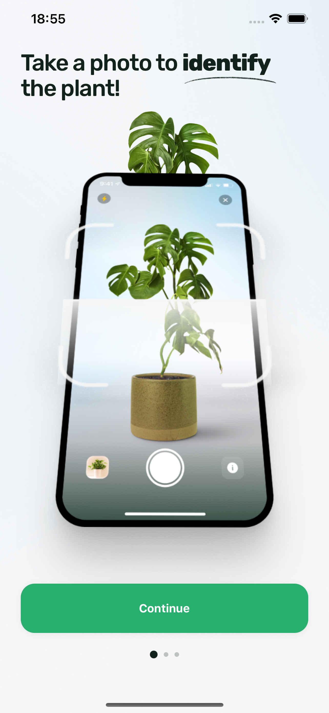
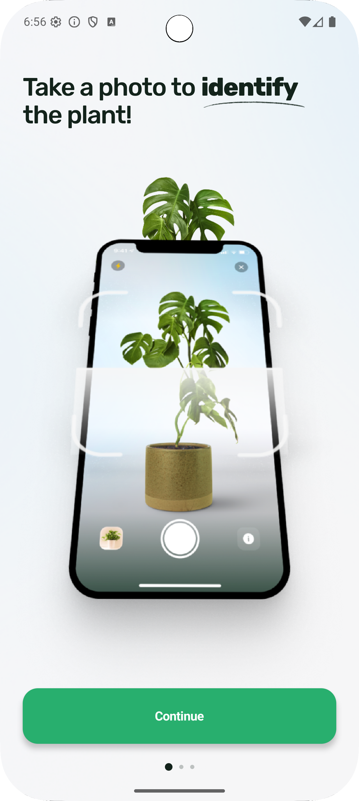
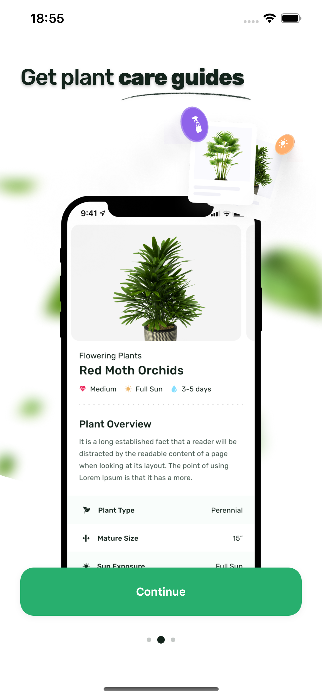
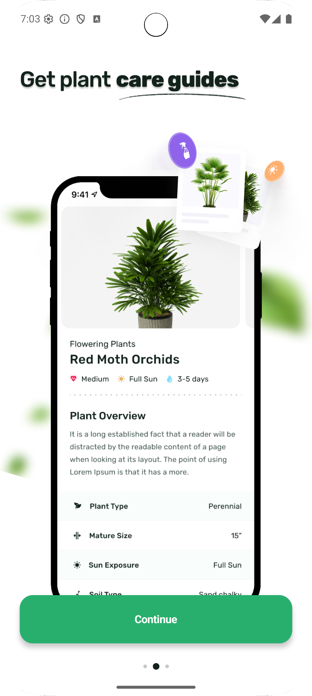
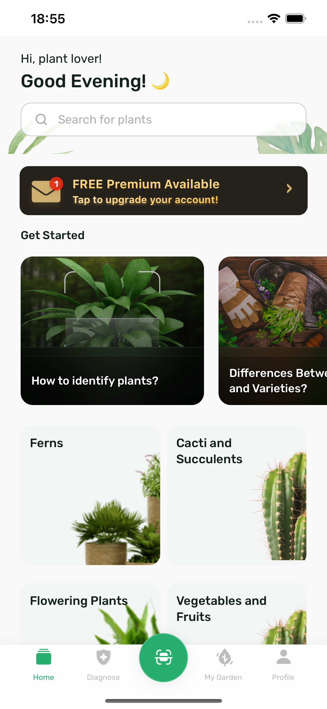
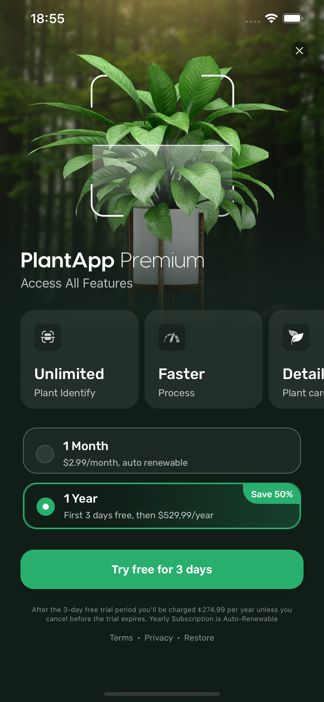
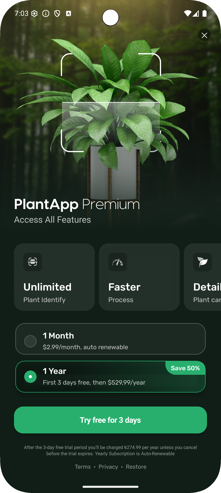

# 🌱  PlantApp – HubX React Native Case Study  

Bu repo, **HubX** için yaptığım React Native case-study çalışmasının kaynak kodunu içerir. Amaç; tasarımları eksiksiz uygulamak, iOS & Android’de tutarlı bir deneyim sunmak ve temiz, ölçeklenebilir bir proje iskeleti göstermektir.

---

## İçindekiler
1. [Özellikler](#özellikler)
2. [Ekran Görüntüleri](#ekran-görüntüleri)
3. [Kurulum](#kurulum)
4. [Ortam Değişkenleri](#ortam-değişkenleri)
5. [Çalıştırma ve Script’ler](#çalıştırma-ve-scriptler)
6. [Mimari ve Klasör Yapısı](#mimari-ve-klasör-yapısı)
7. [Kullanılan Teknolojiler](#kullanılan-teknolojiler)
8. [Katkı & Lisans](#katkı--lisans)

---

## Özellikler
- **Onboarding + Paywall** akışı  
- **Ana sayfa**: Makale & kategori kartları, premium banner  
- **Kategori detay** ve **makale webview** ekranları  
- Redux Toolkit - async thunk ile **uzak API’den veri çekme**  
- **Tip güvenliği**: TypeScript + RTK slices + navigation types  
- Android & iOS için **uyarlanmış tasarım ölçüleri** (Figma → utils/px.ts)  
- **Gradient, shadow, blurred background** bileşenleri  
- .env ile **ortam bazlı API adresi**  

---

## Ekran Görüntüleri

| Ekran                     | iOS                                                  | Android                                                     |
|---------------------------|------------------------------------------------------|-------------------------------------------------------------|
| **Get Started**           |                   |                       |
| **Onboarding 1**          |                  |                      |
| **Onboarding 2**          |                  |                      |
| **Ana Sayfa (Home)**      |                     |                         |
| **Paywall**               |                      |                          |

---

## Kurulum
```bash
# 1. repoyu klonla
git clone https://github.com/kullanici-adi/PlantApp.git
cd PlantApp

# 2. bağımlılıkları kur
npm install          # veya pnpm / yarn

# 3. iOS için pod kur
cd ios && pod install && cd ..

# 4. iOS için çalıştırma
npx react-native run-ios

# 5. Android için çalıştırma
npx react-native run-android


Ortam Değişkenleri

Proje köküne .env dosyası oluşturun:

API_BASE_URL=https://dummy-api-jtg6bessta-ey.a.run.app

react-native-dotenv otomatik çeker.

⸻


Mimari ve Klasör Yapısı
assets/
 ├── fonts/
 ├── images/
src
 ├── api/               # axios client + endpoint’ler
 ├── components/        # tekrar kullanılabilir UI parçaları
 ├── navigation/        # stack & tab tanımları + türler
 ├── screens/           # ekran dosyaları
 ├── store/             # Redux Toolkit slices
 ├── theme/             # renk, spacing, shadow, vb.
 ├── types/             # env.d.ts
 └── utils/             # yardımcı fonksiyonlar (px, platformStyles…)

Erişilebilirlik: Bileşenlerde accessible, accessibilityLabel, role kullanıldı.
Tipler: Ekran-arası parametrelerde ReactNavigation.RootParamList genişletildi.

⸻


Bu proje, HubX React Native Case Study kapsamında Volkan Eren Erdoğan tarafından geliştirilmiştir.

